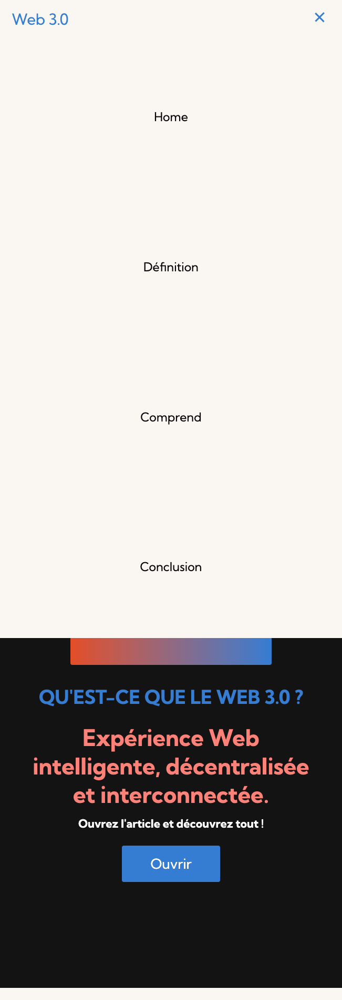

<h1>WEB 3.0 Page</h1>
  

<h2>Pages:</h2>

<h2 align="center">Desktop Version:</h2>
<p align="center"></p>

<h2 align="center">Mobile Version:</h2>

<p align="center">
<br/>

&nbsp;

</p>

<h2>Usage: </h2>

```bash

git clone https://github.com/universal-developer/WEB-3.0-website

cd WEB-3.0-website
```

<h2>And then just put index.html file in your browser ;)</h2>

<hr>
